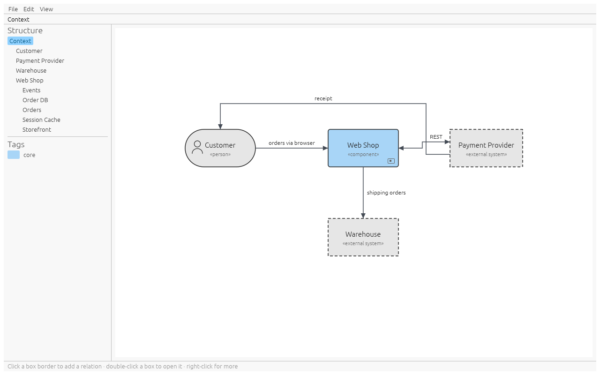

# Guide

whiteboxed draws the building-block view of [arc42](https://arc42.org) (section 5):
the context view, and for every box its whitebox one level deeper. You describe
boxes and relations; the app does the layout. For step-by-step recipes see
[Workflows](workflows.md).

## The window



- **Menu bar**: File (new, open, save, export), Edit (undo, redo), View (fit, up one
  level).
- **Breadcrumb** under the menu: where you are, e.g. `Context › Web Shop › Orders`.
  Click any part to jump there.
- **Structure** (left): every box of the project as a tree. Click a box to show it in
  its diagram, double-click it to open its whitebox.
- **Tags** (left, below the tree): every tag with its colour.
- **Canvas** (centre): the current diagram.
- **Status bar** (bottom): hints, errors, and the number of interfaces in this
  whitebox that are not assigned to a box yet.

## Levels

| Level | Shows                                                                 |
|-------|-----------------------------------------------------------------------|
| 0     | The context view: your system(s) and their neighbours                 |
| 1     | The whitebox of a level-0 box: its building blocks                    |
| 2, 3… | The whitebox of a box one level up; there is no depth limit           |

A box is a blackbox on its own level. Opening it shows its whitebox: a frame with the
box's name, the boxes inside it, and every relation that reaches the box from outside.


## Box types

| Type            | Drawn as                       | Where                | Opens into a whitebox |
|-----------------|--------------------------------|----------------------|-----------------------|
| component       | rectangle                      | every level          | yes                   |
| database        | cylinder                       | every level          | yes                   |
| queue/topic     | horizontal pipe                | every level          | yes                   |
| cache           | rectangle with a double border | every level          | yes                   |
| file storage    | folder                         | every level          | yes                   |
| UI              | window with a title bar        | every level          | yes                   |
| person          | rounded box with a figure      | context view only    | no                    |
| external system | dashed grey rectangle          | context view only    | no                    |

Every box has a **name**, unique within its diagram (case does not matter), a
**type**, and at most one **tag**. A small mark in the lower right corner shows that a
box has content in its whitebox.

## Relations

A relation connects two boxes of the same diagram. It has:

- a **direction** seen from the box you started at: **out** (arrow to the other box),
  **in** (arrow to your box) or **bi** (both);
- an optional **text**, shown next to the line.

Two boxes can share several relations, e.g. a REST call one way and events the other.

### Relations across levels

When a relation reaches a box, it also shows up inside that box's whitebox: it enters
through the frame on the same side, labelled with the partner outside. Inside, you
**attach** it to the box that actually handles it. Until then it ends in an orange
warning marker, and the status bar counts it.

Deleting such a line inside a whitebox only detaches it there; the relation itself
stays on its own level.

### Stubs

A **stub** is a relation whose other end is not known yet, drawn with an open circle.
A stub you create inside a whitebox leaves that level: every enclosing box shows it on
the same side, up to the context view. You can connect it on any of those levels by
clicking its open end.

## Layout

There is nothing to position by pixel.

- Every diagram is a grid. A box occupies one cell; columns and rows take the size of
  their largest box.
- A box grows along a side as more relations attach to that side.
- Lines run horizontally and vertically through the gaps between cells and never
  through a box. Gaps widen to fit long labels.
- The side you click is the side the partner ends up on. A new box goes to the cell
  next to it; if that cell is taken, to the nearest free cell in the same column (or
  row, for top and bottom).
- Connecting an **existing** box on a side moves it there. If that would break the side
  of another relation, the app asks: **move** it (default) or **keep** it and route
  the line around.
- You can still move a box: drag it to another cell, or select it and use the arrow
  keys. A box already in that cell swaps places with it.
- The same project always gives the same picture.

## Tags

Type a tag name in the box popup. Tags are project-wide: the same tag has the same
colour on every level. A new tag gets the next colour of a 10-colour palette; click
its swatch in the sidebar to pick another.

## Files

A project is one YAML file. It holds the boxes, relations, tags and the grid cell of
each box, never pixel coordinates, so a diff shows what changed in the architecture.
Lists are written in a fixed order. See [the file format](#file-format) below.

- **Ctrl+S** saves; the first save asks for a file name.
- Two seconds after every change, the app writes a **recovery file** in your user data
  directory (`whiteboxed/recovery`). Saving removes it. If the app crashes, the next
  start offers to restore the unsaved work.
- Closing, opening or starting a new project with unsaved changes asks first.

## Export

File > **Export diagram as SVG/PNG** writes the diagram on screen. **Export all
diagrams** writes an SVG and a PNG for the context view and every whitebox with
content into a folder, named after the breadcrumb (e.g. `context - Web Shop.svg`).
Exports look exactly like the canvas.

## Keys

| Key                   | Does                                         |
|-----------------------|----------------------------------------------|
| Enter                 | Confirm a popup; open the selected box       |
| Esc                   | Close a popup; stop picking; deselect        |
| Backspace             | Up one level                                 |
| F2                    | Edit the selected box                        |
| Delete                | Delete the selected box                      |
| Arrow keys            | Move the selected box one cell               |
| Ctrl+Z                | Undo                                         |
| Ctrl+Shift+Z / Ctrl+Y | Redo                                         |
| Ctrl+S                | Save                                         |
| Ctrl+Shift+S          | Save as                                      |
| Ctrl+O                | Open                                         |
| Ctrl+N                | New project                                  |
| Ctrl+scroll           | Zoom                                         |

## File format

```yaml
format: 1
tags:
- id: 2
  name: core
  color: '#a8d5f7'
blocks:
- id: 1
  name: Customer
  kind: person
  cell:
    col: 0
    row: 0
- id: 3
  name: Web Shop
  kind: component
  tag: 2
  cell:
    col: 1
    row: 0
- id: 5
  name: Storefront
  kind: ui
  parent: 3          # lives in the whitebox of box 3
  cell:
    col: 0
    row: 0
relations:
- id: 4
  a:                 # where the relation starts
  - block: 1
    side: right
  b:                 # where it ends: Web Shop, attached inside to Storefront
  - block: 3
    side: left
  - block: 5
    side: left
  direction: out     # seen from a
  text: orders via browser
```

- `kind`: `component`, `database`, `queue`, `cache`, `file_storage`, `ui`, `person`,
  `external_system`.
- A relation belongs to the diagram of `owner` (omitted: the context view). Each end
  lists the box on that level, then the box it is attached to inside, and so on. An
  empty end (`b: []`) is an open stub end.
- `side`: `top`, `right`, `bottom`, `left`.
