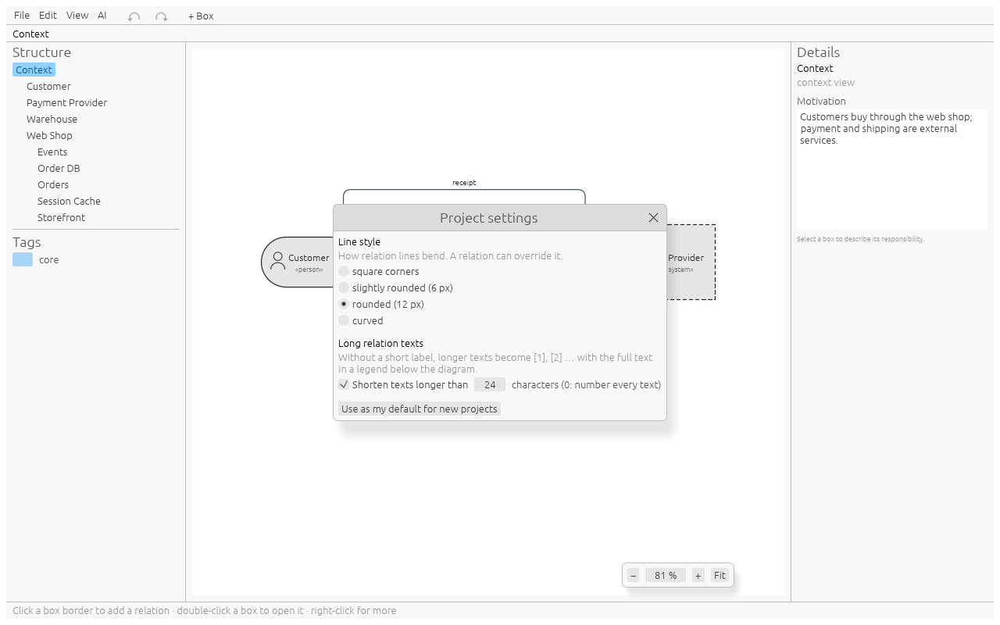
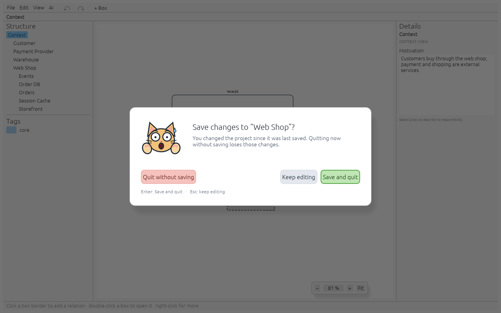
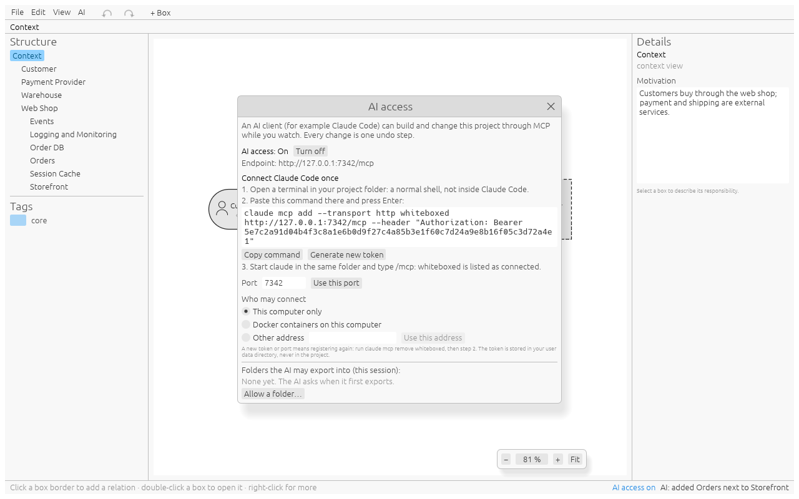

# Guide

whiteboxed draws the building-block view of [arc42](https://arc42.org) (section 5):
the context view, and for every box its whitebox one level deeper. You describe
boxes and relations; the app does the layout. It also keeps the texts arc42 asks for
next to each diagram and exports them. For step-by-step recipes see
[Workflows](workflows.md).

## The window


- **Menu bar**: File (new, open, save, export), Edit (undo, redo), View (fit, up one
  level), the **undo** and **redo** arrows, and **+ Box**, which adds a box without a
  relation in the next free cell. An arrow is grey when there is nothing to undo or
  redo.
- **Breadcrumb** under the menu: where you are, e.g. `Context › Web Shop › Orders`.
  Click any part to jump there.
- **Structure** (left): every box of the project as a tree. Click a box to show it in
  its diagram, double-click it to open its whitebox.
- **Tags** (left, below the tree): every tag with its colour.
- **Canvas** (centre): the current diagram.
- **Details** (right): the **responsibility** of the selected box, or the
  **motivation** of the current diagram when nothing is selected. See
  [arc42 texts](#arc42-texts).
- **Status bar** (bottom): hints, errors, and the number of interfaces in this
  whitebox that are not assigned to a box yet.

## Levels

| Level | Shows                                                       |
|-------|-------------------------------------------------------------|
| 0     | The context view: your system(s) and their neighbours       |
| 1     | The whitebox of a level-0 box: its building blocks          |
| 2, 3… | The whitebox of a box one level up; there is no depth limit |

A box is a blackbox on its own level. Opening it shows its whitebox: a frame with the
box's name, the boxes inside it, and every relation that reaches the box from outside.


## Box types

| Type            | Drawn as                       | Where             | Opens into a whitebox |
|-----------------|--------------------------------|-------------------|-----------------------|
| component       | rectangle                      | every level       | yes                   |
| database        | cylinder                       | every level       | yes                   |
| queue/topic     | horizontal pipe                | every level       | yes                   |
| cache           | rectangle with a double border | every level       | yes                   |
| file storage    | folder                         | every level       | yes                   |
| UI              | window with a title bar        | every level       | yes                   |
| person          | rounded box with a figure      | context view only | no                    |
| external system | dashed grey rectangle          | context view only | no                    |

Every box has a **name**, unique within its diagram (case does not matter), a
**type**, and at most one **tag**. A small mark in the lower right corner shows that a
box has content in its whitebox.

## Relations

A relation connects two boxes of the same diagram. It has:

- a **direction** seen from the box you started at: **out** (arrow to the other box),
  **in** (arrow to your box) or **bi** (both);
- an optional **text**, shown next to the line;
- an optional **short label**, shown on the line instead of a long text;
- a **line style**: the project's, or its own (square corners, slightly rounded,
  rounded or curved);
- the **side** of each box it leaves from. It follows the layout (see
  [Layout](#layout)); you can pick another one in the relation's **Edit…** dialog,
  until one of its boxes moves.

Two boxes can share several relations, e.g. a REST call one way and events the other.

### Long texts and the legend

A text longer than the limit in [Project settings](#project-settings) (24 characters
out of the box) is not written on the line. The line shows its short label, or a
number like `[2]` if it has none, and the full text goes to a **legend** below the
diagram. Numbers count the relations of the diagram in order. In the app, hovering a
line shows its full text. The legend is part of every export; the tables of the
documentation export always carry the full texts.

### Relations across levels

When a relation reaches a box, it also shows up inside that box's whitebox: it enters
through the frame on the same side, labelled with the partner outside. Inside, you
**attach** it to the box that actually handles it. Until then it ends in an orange
warning marker, and the status bar counts it.

Deleting such a line inside a whitebox only detaches it there; the relation itself
stays on its own level.

### Stubs

A **stub** is a relation whose other end is not known yet, drawn with an open circle.
A stub you create inside a whitebox leaves that level: every enclosing box shows it on
the same side, up to the context view. You can connect it on any of those levels by
clicking its open end.

## Layout

There is nothing to position by pixel.

- Every diagram is a grid. A box occupies one cell; columns and rows take the size of
  their largest box.
- Lines on one side of a box keep 40 px apart, so a box grows along a side from its
  second relation there. A box never gets smaller than its minimum size.
- Lines run horizontally and vertically through the gaps between cells and never
  through a box. Gaps widen to fit long labels. A line leaves a box where its partner
  is, so two boxes facing each other are joined by a straight line.
- Lines avoid crossing each other where a short detour or a different lane allows it.
  Where two lines still cross, the horizontal one jumps over the other in a small arc.
- Labels stay inside the whitebox frame, wrapped onto several lines if needed.
- The side you click is the side the partner ends up on. A new box goes to the cell
  next to it. Several new boxes on the same side fill a block that stays as square as
  possible: 2 side by side, then 2×2, 3×2, 3×3 …
- Relations from the level above enter a whitebox opposite the box that takes them.
- Connecting an **existing** box on a side moves it there. If that would break the side
  of another relation, the app asks: **move** it (default) or **keep** it and route
  the line around.
- You can still move a box: drag it to another cell, or select it and use the arrow
  keys. A box already in that cell swaps places with it. After a move, the lines of
  the moved boxes leave them on the sides facing their partners, also where you had
  picked a side by hand.
- The same project always gives the same picture.

## Project settings

**File > Project settings…** holds what applies to the whole project:



- **Line style**: how relation lines bend. A relation can override it in its
  **Edit…** dialog.
- **Shorten texts longer than … characters**: from which length a text moves to the
  legend (see [Long texts and the legend](#long-texts-and-the-legend)). 0 numbers
  every text; unticked, texts are never shortened.
- **Use as my default for new projects** keeps the current line style for every new
  project on this computer.

## arc42 texts

arc42 describes every level with a few texts besides the diagram. whiteboxed keeps
two of them and builds the tables from the model:

| Text           | Where                            | Typed in                             |
|----------------|----------------------------------|--------------------------------------|
| Responsibility | every box                        | Details panel, with the box selected |
| Motivation     | the context view, every whitebox | Details panel, with nothing selected |

Relation texts serve as the interface descriptions. Typing stays in the field until
you leave it; then the change becomes one step for undo. Inside the field, Ctrl+Z
undoes your typing only.

## Tags

Type a tag name in the box popup. Tags are project-wide: the same tag has the same
colour on every level. A new tag gets the next colour of a 10-colour palette; click
its swatch in the sidebar to pick another.

## Files

A project is one YAML file. It holds the boxes, relations, tags and the grid cell of
each box, never pixel coordinates, so a diff shows what changed in the architecture.
Lists are written in a fixed order. See [the file format](#file-format) below.

- **Ctrl+S** saves; the first save asks for a file name.
- Two seconds after every change, the app writes a **recovery file** in your user data
  directory (`whiteboxed/recovery`). Saving removes it. If the app crashes, the next
  start offers to restore the unsaved work.
- Closing, opening or starting a new project with unsaved changes asks first. Enter
  saves, Esc keeps editing.



## Export

File > **Export diagram as SVG/PNG** writes the diagram on screen. Exports look
exactly like the canvas.

**Export all as AsciiDoc…** and **Export all as Markdown…** write, for the context
view and every whitebox with content, into one folder:

- an SVG and a PNG, named after the breadcrumb (e.g. `context - Web Shop.svg`);
- a text file with the same name (`context - Web Shop.adoc` or `.md`);
- `index.adoc` or `index.md`, which puts them in order: the context first, then the
  whiteboxes level by level.

The context file holds the image, the motivation as explanation, and two tables. A
partner's description is the responsibility typed for that person or external system.

| Table                  | Columns                             | From                                                      |
|------------------------|-------------------------------------|-----------------------------------------------------------|
| Communication partners | Partner, Description, Input, Output | the partners' responsibility and the arrows to your boxes |
| Building blocks        | Name, Responsibility                | your own boxes                                            |

A whitebox file holds the image, the motivation and three tables:

| Table                     | Columns                                      |
|---------------------------|----------------------------------------------|
| Contained building blocks | Name, Responsibility                         |
| External interfaces       | Partner outside, Handled by, Direction, Text |
| Internal relations        | From, To, Direction, Text                    |

An interface no box takes yet appears as "not assigned"; an empty cell shows "–".
Each file starts at heading level 3 (`===` / `###`), so it fits under a chapter of
your own arc42 document: `include::context - Web Shop.adoc[]` in AsciiDoc. In
Markdown, which has no includes, the index links the files.

## AI access (MCP)

An AI client can build and change the open project while you watch. whiteboxed offers
its editing operations as [MCP](https://modelcontextprotocol.io) tools on
`http://127.0.0.1:<port>/mcp`.



- **Off by default.** **AI > Allow AI access** turns it on until you turn it off or
  quit; the next start begins with it off.
- **Token.** Every request needs the access token, as `Authorization: Bearer <token>`
  or as `?token=<token>` in the URL. The token is made once per user and stored in
  your user data directory (`whiteboxed/ai.yaml`), never in a project. **Generate new
  token** in the dialog replaces it; clients then need the new one.
- **Port.** 7342 unless you choose another in the dialog. A port that is taken shows an
  error instead of silently moving.
- **Same rules as a click.** Every tool call goes through the same checks as the GUI
  and is **one undo step**. A refused call changes nothing and tells the AI why.
- **Follow AI** (AI menu, on by default) shows the diagram the AI just changed. The
  status bar shows "AI access on" and the last change; click it to go there.
- **Exports need your permission.** `export_docs` only writes into folders you allowed
  for this session. The first export into a new folder fails and whiteboxed asks
  **Allow for this session / Don't allow**; the AI then tries again. The AI dialog
  lists the allowed folders, can revoke them and can allow one in advance. Exports
  never follow symbolic links out of an allowed folder.
- **What the AI may not do:** save, open or start a project, read files, or run
  anything. That stays with you.

| Tool                 | Does                                                              |
|----------------------|-------------------------------------------------------------------|
| `get_model`          | The whole project as JSON                                         |
| `get_diagram`        | One diagram: boxes, cells, lines, open and unassigned ends        |
| `render_diagram`     | One diagram as PNG, as you see it                                 |
| `add_box`            | A box without relation                                            |
| `connect_new`        | A new box on one side of a box, connected                         |
| `connect_existing`   | Two boxes of a diagram; `placement` move (default) or keep        |
| `add_stub`           | A relation that leaves the level                                  |
| `connect_open_end`   | A stub's open end to a box                                        |
| `attach`             | A relation from the level above to the box inside that handles it |
| `edit_box`           | Name, type, tag                                                   |
| `edit_relation`      | Direction, text                                                   |
| `set_responsibility` | A box's responsibility                                            |
| `set_motivation`     | A diagram's motivation                                            |
| `move_box`           | A box to another grid cell                                        |
| `delete_box`         | A box; one with content only with `recursive: true`               |
| `delete_relation`    | A relation, or with `detach_in` only its end in a whitebox        |
| `export_docs`        | Images, arc42 texts and index into a folder you allowed           |

Boxes are addressed by id or by their path of names from the context view, as a list
(`["Web Shop", "Orders"]`) or as one string (`"Web Shop/Orders"`). Names compare
without case. The context view is the default diagram.

## Keys

| Key                   | Does                                   |
|-----------------------|----------------------------------------|
| Enter                 | Confirm a popup; open the selected box |
| Esc                   | Close a popup; stop picking; deselect  |
| Backspace             | Up one level                           |
| F2                    | Edit the selected box                  |
| Delete                | Delete the selected box                |
| Arrow keys            | Move the selected box one cell         |
| Ctrl+Z                | Undo                                   |
| Ctrl+Shift+Z / Ctrl+Y | Redo                                   |
| Ctrl+S                | Save                                   |
| Ctrl+Shift+S          | Save as                                |
| Ctrl+O                | Open                                   |
| Ctrl+N                | New project                            |
| Ctrl+scroll           | Zoom                                   |

## File format

```yaml
format: 1
motivation: Customers buy through the web shop.   # explanation of the context view
tags:
- id: 2
  name: core
  color: '#a8d5f7'
blocks:
- id: 1
  name: Customer
  kind: person
  cell:
    col: 0
    row: 0
- id: 3
  name: Web Shop
  kind: component
  tag: 2
  cell:
    col: 1
    row: 0
  responsibility: Sells the catalogue online.
  motivation: Split by responsibility.             # of its whitebox
- id: 5
  name: Storefront
  kind: ui
  parent: 3          # lives in the whitebox of box 3
  cell:
    col: 0
    row: 0
relations:
- id: 4
  a:                 # where the relation starts
  - block: 1
    side: right
  b:                 # where it ends: Web Shop, attached inside to Storefront
  - block: 3
    side: left
  - block: 5
    side: left
  direction: out     # seen from a
  text: orders via browser
  short: browser     # optional: shown instead of a long text
  style: curved      # optional: overrides the project's line_style
```

Project-wide settings sit at the top of the file and are only written when they
differ from the defaults: `line_style` (`square`, `round6`, `round12`, `curved`;
default `round12`) and `label_limit` (default 24; `never` turns shortening off).

- `kind`: `component`, `database`, `queue`, `cache`, `file_storage`, `ui`, `person`,
  `external_system`.
- A relation belongs to the diagram of `owner` (omitted: the context view). Each end
  lists the box on that level, then the box it is attached to inside, and so on. An
  empty end (`b: []`) is an open stub end.
- `side`: `top`, `right`, `bottom`, `left`.
- Empty texts (`motivation`, `responsibility`, `text`) are left out.
