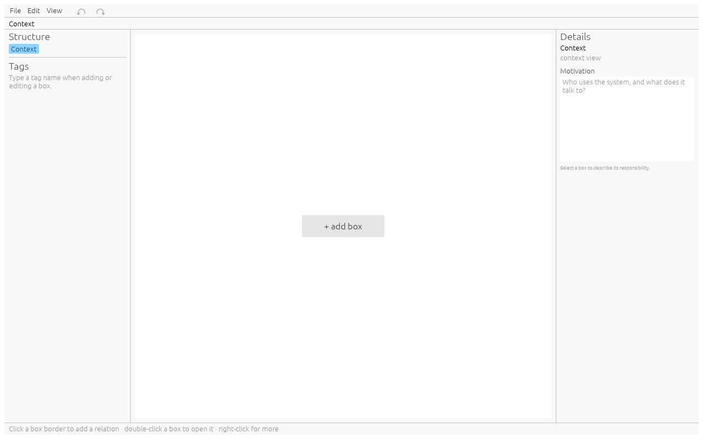
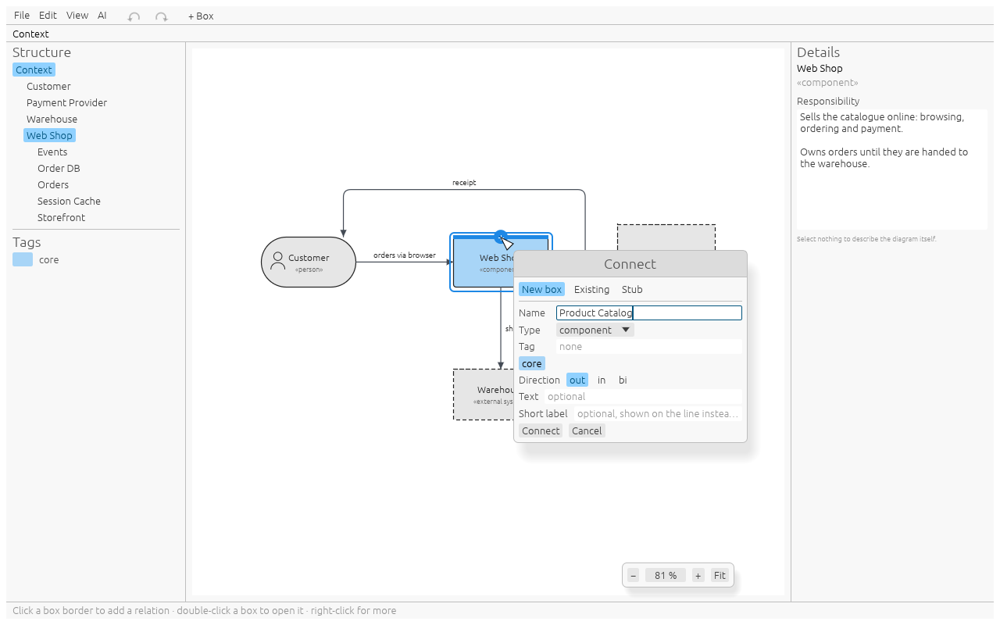
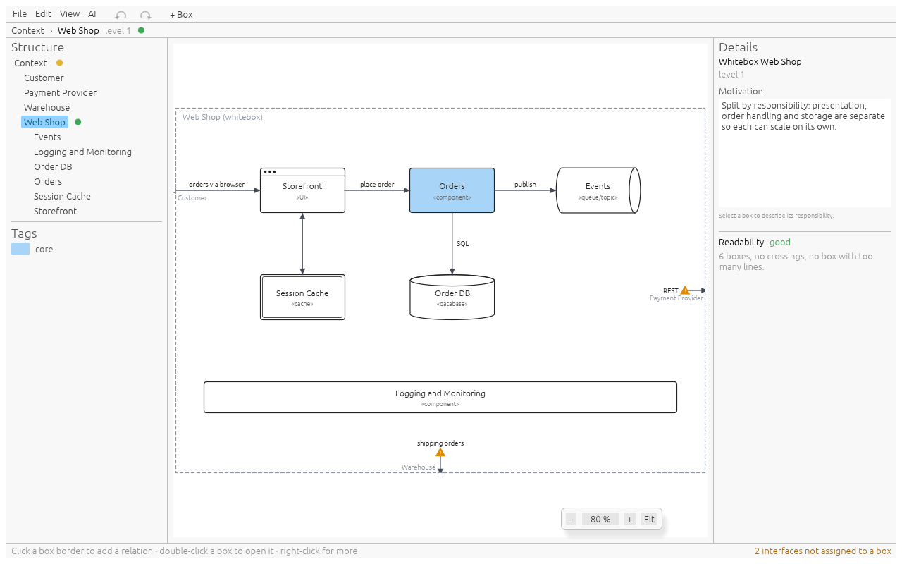

# Workflows

Step-by-step recipes for the things you do most. The concepts behind them are in the
[Guide](guide.md).

## Start the context view



1. Start whiteboxed. The empty canvas shows **+ add box**.
2. Click it, type the name of your system, e.g. `Web Shop`, keep the type
   **component**, press **Enter**.
3. Hover the left border of the box: it turns blue with a **+**. Click it.
4. The popup opens on **New box**. Type `Customer`, choose the type **person**, set the
   direction to **in** (the customer calls the shop), type `orders via browser` as the
   text, press **Enter**. The customer appears to the left, with an arrow into the
   shop.
5. Click the right border of the shop, add `Payment Provider` as an **external system**,
   set the direction to **bi**, text `REST`.
6. Click the bottom border and add `Warehouse` the same way.



Persons and external systems only exist in the context view, so the type list offers
them only there.

## Look inside a box (whitebox)

1. Double-click `Web Shop` (or select it and press **Enter**). The canvas shows the
   frame `Web Shop (whitebox)` and the breadcrumb reads `Context › Web Shop`.
2. The relations of the shop enter through the frame, each labelled with its partner
   (`Customer`, `Payment Provider`, `Warehouse`) and ending in an orange warning
   marker: nobody inside handles them yet. The status bar counts them.
3. Click **+ add box** and add `Storefront` of type **UI**.
   

4. Click the warning marker of the `Customer` relation. Pick `Storefront` and press
   **Enter**. The line now runs from the frame to the storefront.

   Alternatively: click a border of `Storefront`, choose **Existing**, and pick
   `Customer (outside): orders via browser` from the list.
5. Build the rest from the storefront's borders, e.g. **New box** `Orders` on its right,
   `Order DB` (**database**) below `Orders`.
6. **Backspace** or the breadcrumb takes you back up.

## Connect two boxes that already exist

1. Click the border of the first box on the side where the second one should be.
2. Choose **Existing**, type part of the name to filter, press **Enter** (the first
   match is selected) or click the entry and **Connect**.

   Or click **Pick in diagram** and then click the other box; **Esc** cancels.
3. If the other box is not on that side yet, it moves there. If moving it would break
   the side of one of its other relations, the app asks:
   - **Move** (Enter): the box moves; the other relation keeps its connection and
     leaves from the side that now faces its partner.
   - **Keep, route around**: nothing moves; the new line finds its way around.

## Leave a relation open (stub)

Use a stub when you know a box talks to *something* outside, but not to what yet.

1. Click the border, choose **Stub**, set direction and text, **Connect**.
2. The relation ends in an open circle. Inside a whitebox the stub also leaves the
   level: every enclosing box shows it on the same side, up to the context view.
3. Later, click the open circle (or the open end on any enclosing level), pick the box
   it goes to, and **Connect**. From any other box you can also choose **Existing** and
   pick `<box> (open end): <text>`.

## Rearrange

- To add a box without a relation, right-click an empty spot and choose **Add box
  here** (it lands in that cell), or click **+ Box** in the menu bar.
- Drag a box onto another cell; it snaps. A box already there swaps places.
- Or select a box and use the arrow keys.
- **View > Fit to window** (or right-click empty space) shows the whole diagram again.

## Edit and delete

- Right-click a box: **Edit…** (name, type, tag), **Open whitebox**, **Delete**.
- Right-click a line: **Edit…** (direction, text, short label, line style, the side
  at each box), **Delete**. Double-click a line to
  edit its text directly.
- Deleting a box that has content asks first and removes everything inside it.
- Deleting a line inside a whitebox only detaches it from the box there.
- **Ctrl+Z** undoes anything, **Ctrl+Shift+Z** redoes.

## Colour boxes with tags

1. Edit a box (or create one) and type a tag, e.g. `legacy`. Existing tags show up as
   coloured buttons below the field; click one to use it.
2. Every box with that tag, on every level, gets the tag's colour.
3. To change the colour, click the swatch next to the tag in the sidebar and pick one.

## Save, version and recover

1. **Ctrl+S**, choose a file name like `architecture.yaml` next to your code.
2. Commit the file with the code; the diff shows boxes and relations, not pixels.
3. If the app or the machine crashes, start whiteboxed again (with the same file): it
   offers to restore the changes made since the last save.

## Describe what each box does

1. Click a box. The **Details** panel on the right shows its **Responsibility**. Type
   what the box is responsible for.
2. Click empty canvas. The panel now shows the **Motivation** of the diagram: in the
   context view the explanation of who uses the system, in a whitebox why the box is
   split this way.
3. The text is kept when you click elsewhere. **Ctrl+Z** inside the field undoes
   typing; outside it, it undoes the whole text change.

## Put the diagrams into the arc42 document

1. **File > Export all as AsciiDoc…** (or **as Markdown…**) and pick a folder, e.g.
   `docs/arc42/building-blocks`.
2. You get, per diagram, an SVG, a PNG and a text file named after the breadcrumb
   (`context.adoc`, `context - Web Shop.adoc`), plus `index.adoc`.
3. Without an arc42 document yet: use `index.adoc` (or `index.md`) as it is.
4. With one: include the files where they belong, e.g. in section 3
   `include::context.adoc[]` and in section 5 `include::context - Web Shop.adoc[]`.
5. Export again after changes; the names stay the same.

## Let an AI document a repository

You need Claude Code (or another MCP client) and the repository it should read.

1. Open or start a project in whiteboxed, then **AI > Allow AI access**. The dialog
   shows the endpoint and a command.
2. **Copy command** and run it once in a terminal inside the repository:

   ```sh
   claude mcp add --transport http whiteboxed http://127.0.0.1:7342/mcp --header "Authorization: Bearer <token>"
   ```

   It registers whiteboxed for this repository (`--scope user` registers it for all
   of them). Never use `--scope project`: it writes the entry, token included, into
   `.mcp.json` in the repository, where it ends up in git.
3. Start `claude` in the repository and check with `/mcp` that whiteboxed is
   connected.
4. Ask for the documentation, for example:

   > Read this repository and build its arc42 building-block view in whiteboxed:
   > the context view with users and external systems, then a whitebox for the
   > system and for every major module. Give every box a responsibility and every
   > diagram a motivation. Check each diagram with render_diagram, then export the
   > docs as AsciiDoc to docs/arc42 in this repository.

5. Watch the diagrams appear; with **Follow AI** on, the window shows each change.
   Correct anything by hand, or undo the AI's steps one by one with **Ctrl+Z**.
6. When the AI exports, whiteboxed asks whether it may write into that folder.
   **Allow for this session**; the AI repeats the export.
7. **Ctrl+S** saves the project. The AI cannot save; the recovery file protects the
   work until you do.
8. **AI > Allow AI access** again turns the access off.

A new token or port (from the dialog) means running the `claude mcp add` command
again; remove the old entry first with `claude mcp remove whiteboxed`.

